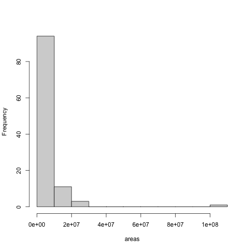
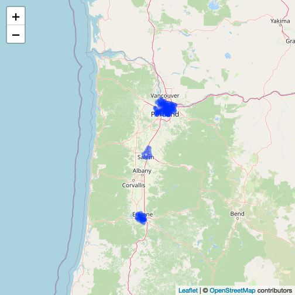
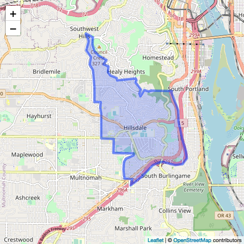

geoops
======


[](https://www.repostatus.org/#active)

[](https://codecov.io/gh/ropensci/geoops)
[](https://cranchecks.info/pkgs/geoops)
[](https://github.com/metacran/cranlogs.app)
[](https://cran.r-project.org/package=geoops)

`geoops` does spatial operations on GeoJSON.

`geoops` is inspired by the JS library turf (http://turfjs.org/). It's
tagline is _Advanced geospatial analysis for browsers and node_.
Turf works only with GeoJSON, as does `geoops`. I don't know JS that well,
but it's easy enough to understand the language, so I've been porting
Turf to C++ wrapped up in R. The C++ so we can have fast performance. We've
also wrapped the Turf JS library itself in the package
lawn (https://github.com/ropensci/lawn), but we should be able to get better
performance out of C++.

`geoops` has a ways to go to include all the methods that Turf has, but
we'll get there eventually.

All data is expected to be in WGS-84.

We use a library from Niels Lohmann (https://github.com/nlohmann/json)
for working with JSON in C++.

See also:

* geojson: https://github.com/ropensci/geojson

Package API:


```
#>  - geo_bearing
#>  - geo_midpoint
#>  - geo_bbox_polygon
#>  - geo_pointgrid
#>  - geo_area
#>  - geo_get_coords
#>  - version
#>  - geo_nearest
#>  - geo_along
#>  - geo_distance
#>  - geo_destination
#>  - geo_trianglegrid
#>  - geo_planepoint
#>  - geo_line_distance
```


## Installation

Stable version


```r
install.packages("geoops")
```

Dev version


```r
remotes::install_github("ropensci/geoops")
```


```r
library("geoops")
```

See the vignette (link here) to get started.


## comparison to rgeos

### distance


```r
pt1 <- '{"type":"Feature","properties":{"marker-color":"#f00"},"geometry":{"type":"Point","coordinates":[-75.343,39.984]}}'
pt2 <- '{"type":"Feature","properties":{"marker-color":"#0f0"},"geometry":{"type":"Point","coordinates":[-75.534,39.123]}}'
library(rgeos)
rgeospt1 <- rgeos::readWKT("POINT(0.5 0.5)")
rgeospt2 <- rgeos::readWKT("POINT(2 2)")
```


```r
microbenchmark::microbenchmark(
  rgeos = rgeos::gDistance(rgeospt1, rgeospt2),
  geoops = geoops::geo_distance(pt1, pt2, units = "miles"),
  times = 10000L
)
#> Unit: microseconds
#>    expr    min      lq     mean  median      uq      max neval
#>   rgeos 22.005 23.5830 34.04165 24.8870 26.3565 5739.353 10000
#>  geoops 27.915 29.3065 36.29756 30.4395 31.8790 1905.728 10000
```

### nearest


```r
point1 <- '{"type":["Feature"],"properties":{"marker-color":["#0f0"]},"geometry":{"type":["Point"],"coordinates":[28.9658,41.0101]}}'
point2 <- '{"type":["FeatureCollection"],"features":[{"type":"Feature","properties":{},"geometry":{"type":"Point","coordinates":[28.9739,41.0111]}},{"type":"Feature","properties":{},"geometry":{"type":"Point","coordinates":[28.9485,41.0242]}},{"type":"Feature","properties":{},"geometry":{"type":"Point","coordinates":[28.9387,41.0133]}}]}'
points <- '{"type":"FeatureCollection","features":[{"type":"Feature","properties":{},"geometry":{"type":"Point","coordinates":[28.9739,41.0111]}},{"type":"Feature","properties":{},"geometry":{"type":"Point","coordinates":[28.9485,41.0242]}},{"type":"Feature","properties":{},"geometry":{"type":"Point","coordinates":[28.9387,41.0133]}}]}'
g1 <- readWKT("MULTILINESTRING((34 54, 60 34), (0 10, 50 10, 100 50))")
g2 <- readWKT("POINT(100 30)")
```


```r
microbenchmark::microbenchmark(
  rgeos = rgeos::gNearestPoints(g1, g2),
  geoops = geoops::geo_nearest(point1, points),
  times = 10000L
)
#> Unit: microseconds
#>    expr     min       lq     mean   median       uq      max neval
#>   rgeos 430.517 445.1615 516.2902 452.5940 466.8535 6744.664 10000
#>  geoops 100.337 110.3815 127.0119 126.6695 131.2805 2202.392 10000
```

## Example use case

<details> <summary><strong>expand</strong></summary>

Get some GeoJSON data, a FeatureCollection of Polygons


```r
file <- system.file("examples/zillow_or.geojson", package = "geoops")
x <- paste0(readLines(file), collapse = "")
```

Break each polygon into separate JSON string


```r
library("jqr")
polys <- unclass(jq(x, ".features[]"))
```

Using `geo_area`, calculate the area of the polygon


```r
areas <- vapply(polys, geo_area, 1, USE.NAMES = FALSE)
```

Visualize area of the polygons as a histogram


```r
hist(areas, main = "")
```



Visualize some of the polygons, all of them


```r
library(leaflet)
leaflet() %>%
  addProviderTiles(provider = "OpenStreetMap.Mapnik") %>%
  addGeoJSON(geojson = x) %>%
  setView(lng = -123, lat = 45, zoom = 7)
```



Just one of them


```r
leaflet() %>%
  addProviderTiles(provider = "OpenStreetMap.Mapnik") %>%
  addGeoJSON(geojson = polys[1]) %>%
  setView(lng = -122.7, lat = 45.48, zoom = 13)
```


</details>


## Meta

* Please [report any issues or bugs](https://github.com/ropensci/geoops/issues).
* License: MIT
* Get citation information for `geoops` in R doing `citation(package = 'geoops')`
* Please note that this project is released with a [Contributor Code of Conduct][coc].
By participating in this project you agree to abide by its terms.

[](https://ropensci.org)

[coc]: https://github.com/ropensci/geoops/blob/master/CODE_OF_CONDUCT.md
