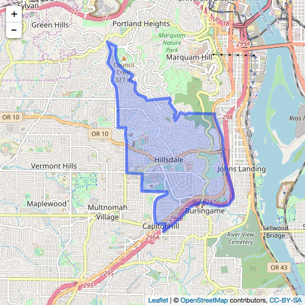
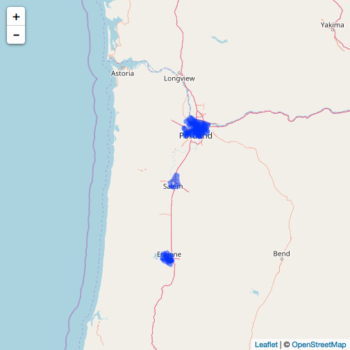
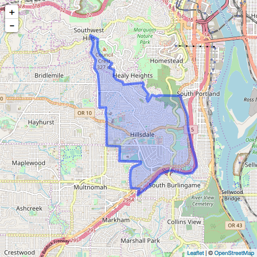

geoops
======


[](https://travis-ci.org/ropensci/geoops)
[](https://codecov.io/gh/ropensci/geoops)
[](https://github.com/metacran/cranlogs.app)
[](https://cran.r-project.org/package=geoops)

`geoops` does spatial operations on GeoJSON.

`geoops` is inspired by the JS library [turf](http://turfjs.org/). It's
tagline is _Advanced geospatial analysis for browsers and node_.
Turf works only with GeoJSON, as does `geoops`. I don't know JS that well,
but it's easy enough to understand the language, so I've been porting
Turf to C++ wrapped up in R. The C++ so we can have fast performance. We've
also wrapped the Turf JS library itself in the package
[lawn](https://github.com/ropensci/lawn), but we should be able to get better
performance out of C++.

`geoops` has a ways to go to include all the methods that Turf has, but
we'll get there eventually.

This package is alpha stage, expect bugs and changes.

All data is expected to be in WGS-84.

We use a library from [Niels Lohmann](https://github.com/nlohmann/json)
for working with JSON in C++.

See also:

* [geofilter](https://github.com/ropensci/geofilter)
* [geojson](https://github.com/ropensci/geojson)

Package API:


```
#>  - geo_bearing
#>  - geo_midpoint
#>  - geo_bbox_polygon
#>  - geo_pointgrid
#>  - geo_area
#>  - geo_get_coords
#>  - version
#>  - geo_nearest
#>  - geo_along
#>  - geo_distance
#>  - geo_destination
#>  - geo_trianglegrid
#>  - geo_planepoint
#>  - geo_line_distance
```


## Installation

Stable version


```r
install.packages("geoops")
```

Dev version


```r
devtools::install_github("ropensci/geoops")
```


```r
library("geoops")
```

## get json c++ library version info


```r
geoops::version()
#> [1] "{\"compiler\":{\"c++\":\"201103\",\"family\":\"clang\",\"version\":\"9.0.0 (clang-900.0.39.2)\"},\"copyright\":\"(C) 2013-2017 Niels Lohmann\",\"name\":\"JSON for Modern C++\",\"platform\":\"apple\",\"url\":\"https://github.com/nlohmann/json\",\"version\":{\"major\":3,\"minor\":0,\"patch\":0,\"string\":\"3.0.0\"}}"
```

## distance

Calculate distance between two GeoJSON points


```r
pt1 <- '{
  "type": "Feature",
  "properties": {
    "marker-color": "#f00"
   },
   "geometry": {
      "type": "Point",
      "coordinates": [-75.343, 39.984]
   }
}'
#'
pt2 <- '{
  "type": "Feature",
  "properties": {
     "marker-color": "#0f0"
   },
   "geometry": {
      "type": "Point",
      "coordinates": [-75.534, 39.123]
    }
}'
```


```r
geo_distance(pt1, pt2)
#> [1] 97.15958
```

## bearing

Calculate bearing between two points


```r
geo_bearing(pt1, pt2)
#> [1] -170.233
```

## destination


```r
geo_destination(pt1, 50, 90, 'miles')
#> [1] "{\"geometry\":{\"coordinates\":[-74.398884,39.98017],\"type\":\"Point\"},\"properties\":{},\"type\":\"Feature\"}"
```

## line distance

Calculate length of GeoJSON LineString or Polygon


```r
line <- '{
  "type": "Feature",
  "properties": {},
  "geometry": {
    "type": "LineString",
    "coordinates": [
      [-77.031669, 38.878605],
      [-77.029609, 38.881946],
      [-77.020339, 38.884084],
      [-77.025661, 38.885821],
      [-77.021884, 38.889563],
      [-77.019824, 38.892368]
    ]
  }
}'
geo_line_distance(line, units = "kilometers")
#> [1] 2.637684
```

## nearest

Calculate nearest point to a reference point


```r
point1 <- '{
  "type": "Feature",
  "properties": {
     "marker-color": "#0f0"
   },
  "geometry": {
     "type": "Point",
     "coordinates": [28.965797, 41.010086]
  }
}'
#'
points <- '{
  "type": "FeatureCollection",
  "features": [
    {
      "type": "Feature",
      "properties": {},
      "geometry": {
        "type": "Point",
        "coordinates": [28.973865, 41.011122]
      }
    }, {
      "type": "Feature",
      "properties": {},
      "geometry": {
        "type": "Point",
        "coordinates": [28.948459, 41.024204]
      }
    }, {
      "type": "Feature",
      "properties": {},
      "geometry": {
        "type": "Point",
        "coordinates": [28.938674, 41.013324]
      }
    }
  ]
}'
geo_nearest(point1, points)
#> [1] "{\"geometry\":{\"coordinates\":[28.973865,41.011122],\"type\":\"Point\"},\"properties\":{},\"type\":\"Feature\"}"
```


## comparison to rgeos

### distance


```r
library(rgeos)
rgeospt1 <- rgeos::readWKT("POINT(0.5 0.5)")
rgeospt2 <- rgeos::readWKT("POINT(2 2)")
```


```r
microbenchmark::microbenchmark(
  rgeos = rgeos::gDistance(rgeospt1, rgeospt2),
  geoops = geoops::geo_distance(pt1, pt2, units = "miles"),
  times = 10000L
)
#> Unit: microseconds
#>    expr    min      lq     mean  median      uq       max neval
#>   rgeos 25.309 28.7050 44.00719 30.5135 34.0175 41640.998 10000
#>  geoops 26.614 29.2905 36.67071 30.6755 34.3395  1798.585 10000
```

### nearest


```r
point1 <- '{"type":["Feature"],"properties":{"marker-color":["#0f0"]},"geometry":{"type":["Point"],"coordinates":[28.9658,41.0101]}}'
point2 <- '{"type":["FeatureCollection"],"features":[{"type":"Feature","properties":{},"geometry":{"type":"Point","coordinates":[28.9739,41.0111]}},{"type":"Feature","properties":{},"geometry":{"type":"Point","coordinates":[28.9485,41.0242]}},{"type":"Feature","properties":{},"geometry":{"type":"Point","coordinates":[28.9387,41.0133]}}]}'
g1 <- readWKT("MULTILINESTRING((34 54, 60 34), (0 10, 50 10, 100 50))")
g2 <- readWKT("POINT(100 30)")
```


```r
microbenchmark::microbenchmark(
  rgeos = rgeos::gNearestPoints(g1, g2),
  geoops = geoops::geo_nearest(point1, points),
  times = 10000L
)
#> Unit: microseconds
#>    expr     min       lq     mean   median       uq       max neval
#>   rgeos 371.256 395.4455 488.6030 420.7625 498.8065 13011.500 10000
#>  geoops 100.243 110.7230 135.4224 125.2550 138.5870  1440.605 10000
```

## Example use case

<details> <summary><strong>expand</strong></summary>

Get some GeoJSON data, a FeatureCollection of Polygons


```r
file <- system.file("examples/zillow_or.geojson", package = "geoops")
x <- paste0(readLines(file), collapse = "")
```

Break each polygon into separate JSON string


```r
library("jqr")
polys <- unclass(jq(x, ".features[]"))
```

Using `geo_area`, calculate the area of the polygon


```r
areas <- vapply(polys, geo_area, 1, USE.NAMES = FALSE)
```

Visualize area of the polygons as a histogram


```r
hist(areas, main = "")
```



Visualize some of the polygons, all of them


```r
library(leaflet)
leaflet() %>%
  addProviderTiles(provider = "OpenStreetMap.Mapnik") %>%
  addGeoJSON(geojson = x) %>%
  setView(lng = -123, lat = 45, zoom = 7)
```



Just one of them


```r
leaflet() %>%
  addProviderTiles(provider = "OpenStreetMap.Mapnik") %>%
  addGeoJSON(geojson = polys[1]) %>%
  setView(lng = -122.7, lat = 45.48, zoom = 13)
```


</details>


## Meta

* Please [report any issues or bugs](https://github.com/ropensci/geoops/issues).
* License: MIT
* Get citation information for `geoops` in R doing `citation(package = 'geoops')`
* Please note that this project is released with a [Contributor Code of Conduct](CONDUCT.md).
By participating in this project you agree to abide by its terms.

[](https://ropensci.org)
