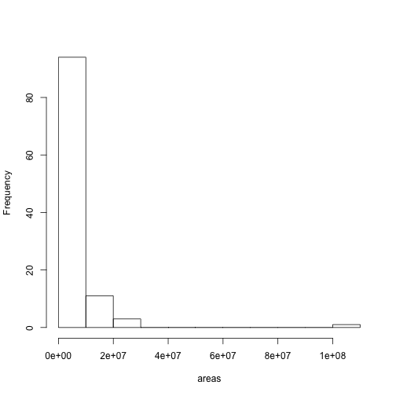
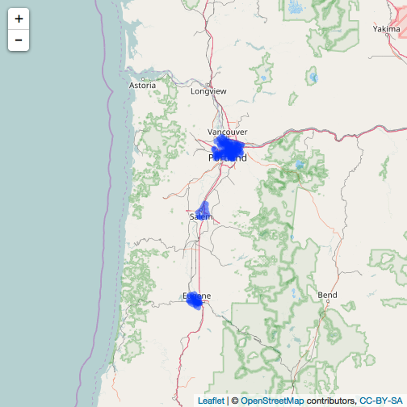
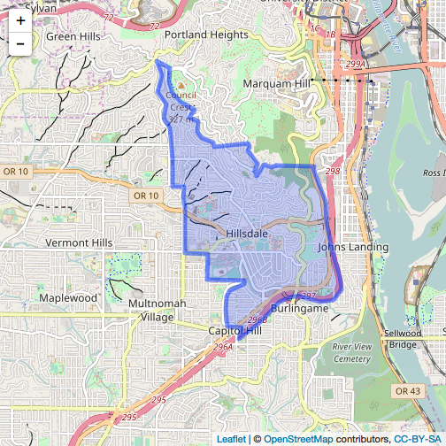

geoops
======


[](https://travis-ci.org/ropenscilabs/geoops)

`geoops` does spatial operations on geojson

This package is alpha stage, expect bugs and changes.

see also: 

* [geofilter](https://github.com/ropenscilabs/geofilter)
* [geojson](https://github.com/ropensci/geojson)

Package API:


```
#>  - geo_bearing
#>  - geo_midpoint
#>  - geo_bbox_polygon
#>  - geo_pointgrid
#>  - geo_bbox
#>  - in_ring
#>  - geo_area
#>  - get_coords
#>  - version
#>  - geo_nearest
#>  - geo_inside
#>  - geo_along
#>  - geo_distance
#>  - geo_destination
#>  - geo_planepoint
#>  - geo_line_distance
```


## Installation


```r
devtools::install_github("ropenscilabs/geoops")
```


```r
library("geoops")
```

## get json c++ library version info


```r
geoops::version()
#> [1] "{\"compiler\":{\"c++\":\"201103\",\"family\":\"clang\",\"version\":\"8.1.0 (clang-802.0.42)\"},\"copyright\":\"(C) 2013-2017 Niels Lohmann\",\"name\":\"JSON for Modern C++\",\"platform\":\"apple\",\"url\":\"https://github.com/nlohmann/json\",\"version\":{\"major\":2,\"minor\":1,\"patch\":1,\"string\":\"2.1.1\"}}"
```

## distance

Calculate distance between two GeoJSON points


```r
pt1 <- '{
  "type": "Feature",
  "properties": {
    "marker-color": "#f00"
   },
   "geometry": {
      "type": "Point",
      "coordinates": [-75.343, 39.984]
   }
}'
#'
pt2 <- '{
  "type": "Feature",
  "properties": {
     "marker-color": "#0f0"
   },
   "geometry": {
      "type": "Point",
      "coordinates": [-75.534, 39.123]
    }
}'
```


```r
geo_distance(pt1, pt2)
#> [1] 97.15958
```

## bearing

Calculate bearing between two points


```r
geo_bearing(pt1, pt2)
#> [1] -170.233
```

## destination


```r
geo_destination(pt1, 50, 90, 'miles')
#> [1] "{\"geometry\":{\"coordinates\":[92.023032,44.995433],\"type\":\"Point\"},\"properties\":{},\"type\":\"Feature\"}"
```

## line distance

Calculate length of GeoJSON LineString or Polygon


```r
line <- '{
  "type": "Feature",
  "properties": {},
  "geometry": {
    "type": "LineString",
    "coordinates": [
      [-77.031669, 38.878605],
      [-77.029609, 38.881946],
      [-77.020339, 38.884084],
      [-77.025661, 38.885821],
      [-77.021884, 38.889563],
      [-77.019824, 38.892368]
    ]
  }
}'
geo_line_distance(line, units = "kilometers")
#> [1] 2.637684
```

## nearest

Calculate nearest point to a reference point


```r
point1 <- '{
  "type": "Feature",
  "properties": {
     "marker-color": "#0f0"
   },
  "geometry": {
     "type": "Point",
     "coordinates": [28.965797, 41.010086]
  }
}'
#'
points <- '{
  "type": "FeatureCollection",
  "features": [
    {
      "type": "Feature",
      "properties": {},
      "geometry": {
        "type": "Point",
        "coordinates": [28.973865, 41.011122]
      }
    }, {
      "type": "Feature",
      "properties": {},
      "geometry": {
        "type": "Point",
        "coordinates": [28.948459, 41.024204]
      }
    }, {
      "type": "Feature",
      "properties": {},
      "geometry": {
        "type": "Point",
        "coordinates": [28.938674, 41.013324]
      }
    }
  ]
}'
geo_nearest(point1, points)
#> [1] "{\"geometry\":{\"coordinates\":[28.973865,41.011122],\"type\":\"Point\"},\"properties\":{},\"type\":\"Feature\"}"
```


## comparison to rgeos


```r
library(rgeos)
rgeospt1 <- rgeos::readWKT("POINT(0.5 0.5)")
rgeospt2 <- rgeos::readWKT("POINT(2 2)")
```


```r
microbenchmark::microbenchmark(
  rgeos = rgeos::gDistance(rgeospt1, rgeospt2),
  geoops = geoops::geo_distance(pt1, pt2, units = "miles"),
  times = 1000L
)
#> Unit: microseconds
#>    expr    min      lq     mean  median      uq      max neval
#>   rgeos 38.335 44.2405 62.86717 47.2015 56.5025  815.583  1000
#>  geoops 32.462 37.7850 51.98544 39.9220 46.8975 1322.670  1000
```

## Example use case

<details> <summary><strong>expand</strong></summary>

Get some GeoJSON data, a FeatureCollection of Polygons


```r
file <- system.file("examples/zillow_or.geojson", package = "geoops")
x <- paste0(readLines(file), collapse = "")
```

Break each polygon into separate JSON string


```r
library("jqr")
polys <- unclass(jq(x, ".features[]"))
```

Using `geo_area`, calculate the area of the polygon


```r
areas <- vapply(polys, geo_area, 1, USE.NAMES = FALSE)
```

Visualize area of the polygons as a histogram


```r
hist(areas, main = "")
```



Visualize some of the polygons, all of them


```r
library(leaflet)
leaflet() %>% 
  addTiles() %>% 
  addGeoJSON(geojson = x) %>% 
  setView(lng = -123, lat = 45, zoom = 7)
```



Just one of them


```r
leaflet() %>% 
  addTiles() %>% 
  addGeoJSON(geojson = polys[1]) %>% 
  setView(lng = -122.7, lat = 45.48, zoom = 13)
```


</details>


## Meta

* Please [report any issues or bugs](https://github.com/ropenscilabs/geoops/issues).
* License: MIT
* Get citation information for `geoops` in R doing `citation(package = 'geoops')`
* Please note that this project is released with a [Contributor Code of Conduct](CONDUCT.md). 
By participating in this project you agree to abide by its terms.

[](https://ropensci.org)
